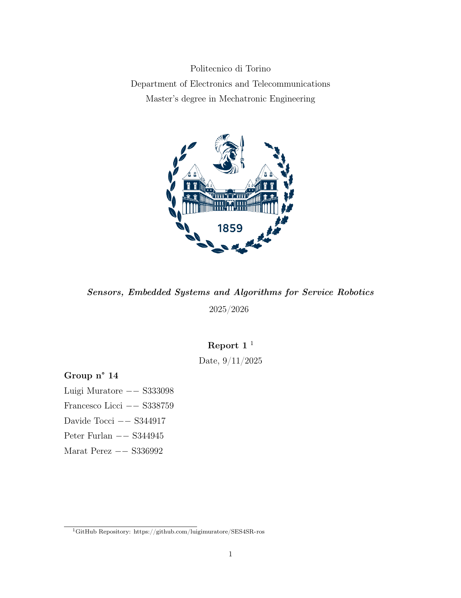
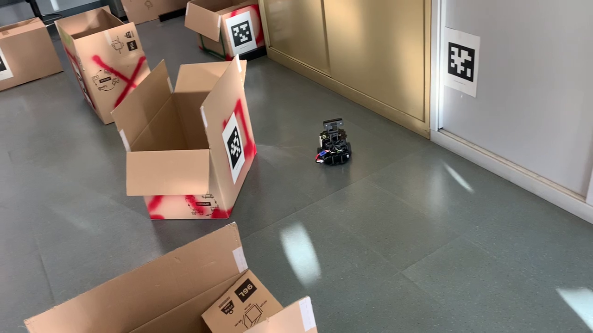
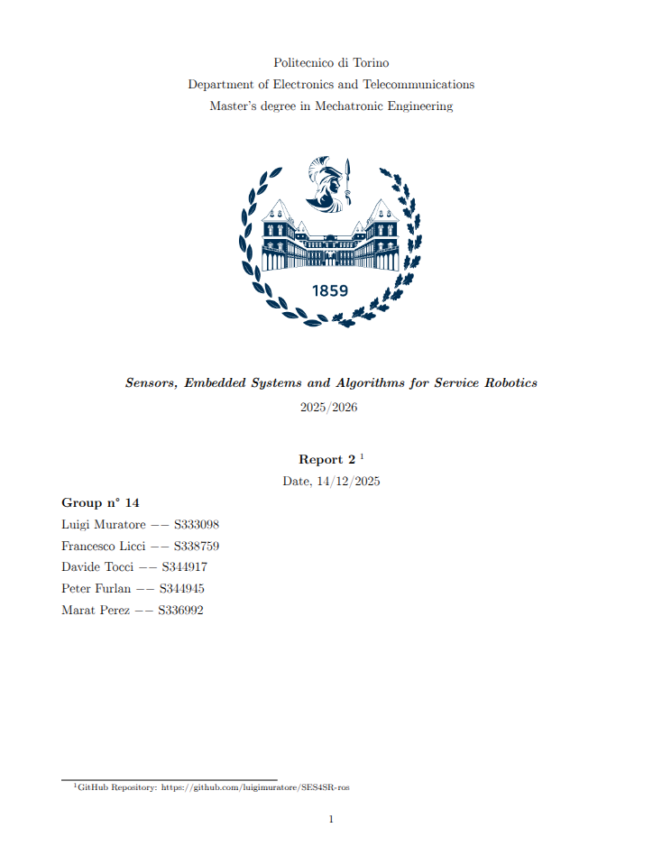
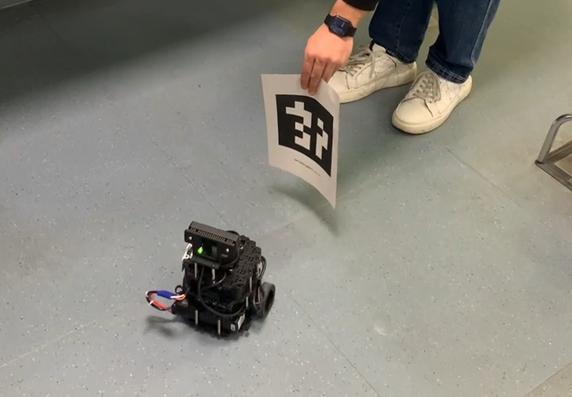
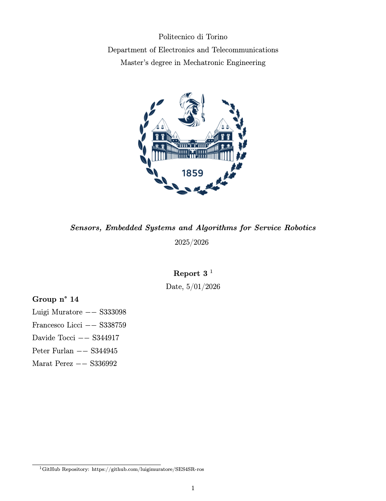

# SES4SR-ros 🤖

## Sensors, embedded systems and algorithms for Service Robotics 

This repo contains all the material and explanation of the laboratories of the course.

## 📚 Index of laboratories

| Laboratory | Description | Preview | Docs |
| --- | ----------- | ------- | ---- |
| [Lab 01](./src/lab01_pkg/lab01_pkg/README.md) | Understanding ROS 2: basic tools, topics, nodes |  |  |
| [Lab 02](./src/lab02_pkg/lab02_pkg/README.md) | Simulation in Gazebo and visualization with Rviz2 |  |  |
| [Lab 03](./src/lab03_pkg/lab03_pkg/README.md) | Bringup and control a real robot |  |  |
| [Lab 04](./src/lab04_pkg/lab04_pkg/README.md) | Localization with EKF |  |   |
| [Lab 05](./src/lab05_pkg/lab05_pkg/README.md) | Control and obstacle avoidance with DWA |  |  |

---

## 🤖 ROVER 
- [Rover](./src/rover/README.md) — Rover robot

<table>
  <tr><th>Real</th><th>Gazebo</th></tr>
  <tr>
    <td></td>
    <td></td>
  </tr>
</table>

---

📌 Each packgae contains:
- Code
- Plots
- README
