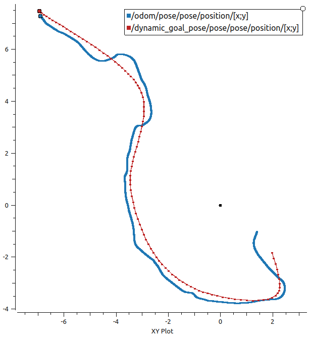
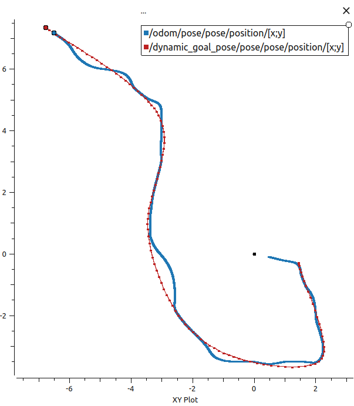
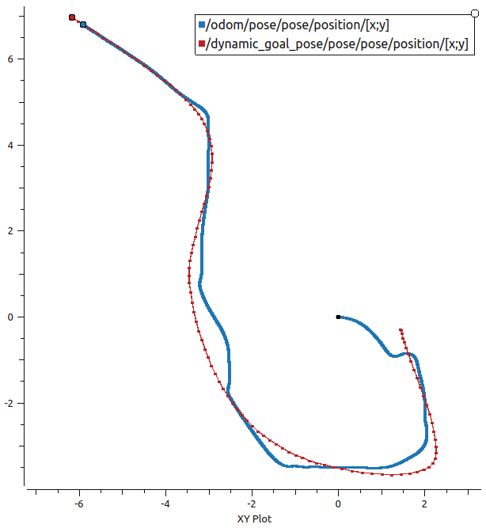
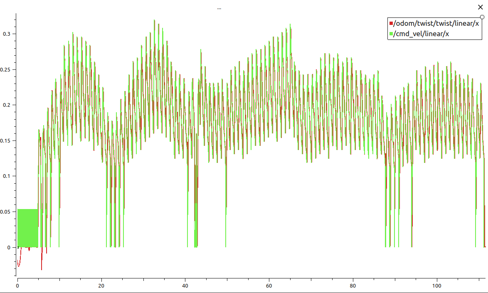
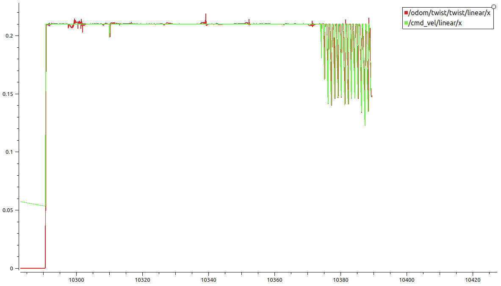
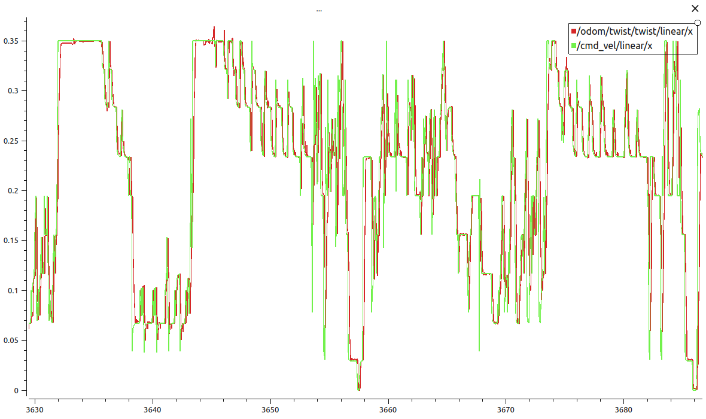

## Lab 05 - Dynamic Window Approach DWA

### Overview

This lab implements a dynamic window approach DWA system to track a moving target while avoiding obstacles, computing real-time metrics.

---

### System Architecture

The system consists of:
- **ROS2 Node**: Main controller
- **DWA Planner**: Path planning, obstacle avoidance with DWA
- **Metrics System**: Real-time tracking performance evaluation
- **Sensors**: LiDAR for obstacle detection, 
- **Odometry**: Localization

---
### Topics

**Subscriber:**
- `/scan` - LiDAR data for obstacle detection
- `/dynamic_goal_pose` - Target pose updates (Simulation)
- `/camera/landmarks` - Target pose updates (Real-World)
- `/odom` - Current robot odometry

**Publisher:**
- `/cmd_vel` - Velocity commands
- `/dwa_feedback` - Feedback about robot phase and current distance to goal
- `/metrics` - Real-time performance metrics

---

### DWA Implementation

The Dynamic Window Approach uses a cost function to evaluate potential trajectories:

**Standard DWA Cost Function:**

$$J = \alpha \cdot heading + \beta \cdot vel + \gamma \cdot dist$$

Where:
- $\alpha$ = heading term weight (0.12)
- $\beta$ = velocity term weight (1.0)
- $\gamma$ = obstacle distance term weight (0.4)

**Extended DWA with Target Tracking:**

$$J = \alpha \cdot heading + \beta \cdot vel' + \gamma \cdot dist_{obst} + \delta \cdot dist_{target}$$

Where:
- $\delta$ = target distance weight (0.5)

##### The velocity reduction component ensures the robot slows down as it approaches the target.
---


## Parameters

```python
'alpha': 0.12        # Heading term
'beta': 1.0          # Velocity term
'gamma': 0.4         # Obstacle term

# Control
'control_rate': 15.0              # Hz
'max_linear_vel': 0.21           # m/s
'max_angular_vel': 3.0           # rad/s

# Safety
'collision_radius': 0.20         # m
'collision_tolerance': 0.18      # m

# Tracking
'desired_distance': 0.5          # m
'tracking_threshold': 2.0        # m
'max_bearing_error': 90.0        # degrees
```

---

## Demonstrations

### Video Demonstrations

#### Demonstration 1

https://github.com/user-attachments/assets/4e507982-ced5-4998-9c22-597da9e6cfda

*Real-world test - Trajectory 1.*

#### Demonstration 2

https://github.com/user-attachments/assets/47603892-ea69-48b0-9695-75380d90791e

*Real-world test - Trajectory 2.*


#### Demonstration 3

https://github.com/user-attachments/assets/feff8794-6225-4bff-a3a4-d4e3eea646cb

*Real-world test - Trajectory 3.*

#### Demonstration 4

https://github.com/user-attachments/assets/9846eefc-f319-4134-98a5-dbd0dcc499c2

*Real-world test - Trajectory 4.*

---

### Plots

#### Odometry Tracking Comparison

<div align="center">
  <table>
    <tr>
      <td align="center">
        
        <br/>
        <em>Bad DWA Parameters - Heading and velocity Error</em>
      </td>
      <td align="center">
        
        <br/>
        <em>Bad DWA Parameters - Heading Error</em>
      </td>
      <td align="center">
        
        <br/>
        <em>Bad DWA Parameters - Velocity Error</em>
      </td>
    </tr>
  </table>
</div>

*Blue: Robot odometry trajectory | Red: Target goal trajectory*

#### Velocity profile Comparison

<div align="center">
  <table>
    <tr>
      <td align="center">
        
        <br/>
        <em>Linear Velocity (Bad Parameters 1)</em>
      </td>
      <td align="center">
        
        <br/>
        <em>Linear Velocity (Bad Parameters 2)</em>
      </td>
      <td align="center">
        
        <br/>
        <em>Linear Velocity (Optimized)</em>
      </td>
    </tr>
  </table>
</div>


---

### Metrics results

#### Simulation test - Bad DWA parameters

```
=== METRICS ===
Success rate: 90%
Track Time: 85% over 120.5s
Distance RMSE: 0.58m
Bearing RMSE: 25.91°
Avg Obstacle Dist: 2.25m
Min Obstacle Dist: 0.45m
```

#### Simulation test - Optimized DWA parameters

```
=== METRICS ===
Success rate: 100%
Track Time: 100% over 110s
Distance RMSE: 0.24m
Bearing RMSE: 12.10°
Avg Obstacle Dist: 2.21m
Min Obstacle Dist: 0.19m
```

#### Average real-world test - Optimized DWA parameters

```
=== METRICS ===
Success rate: 90%
Track Time: 60%
Distance RMSE: 0.5m
Bearing RMSE: 30°
Avg Obstacle Dist: 1m
Min Obstacle Dist: 0.1m
```


---
---

## Running the Code

### Build the Package

```bash
cd ~/SES4SR-ros
colcon build --packages-select lab05_pkg
source install/setup.bash
```

### Launch the System

```bash
ros2 run lab05_pkg task_1_metrics
```

### Monitor Metrics

```bash
ros2 topic echo /metrics
```

---


